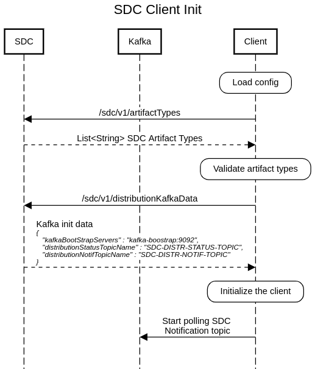
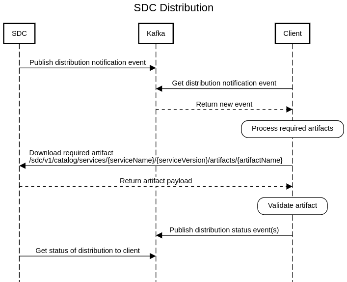

.. This work is licensed under a Creative Commons Attribution 4.0 International License.
.. http://creativecommons.org/licenses/by/4.0
.. Copyright (C) 2022 Nordix Foundation

Architecture
============

..
   * This section is used to describe a software component from a high level
     view of capability, common usage scenarios, and interactions with other
     components required in the usage scenarios.

   * The architecture section is typically: provided in a platform-component
     and sdk collections; and referenced from developer and user guides.

   * This note must be removed after content has been added.

Capabilities
------------

The SDC Distribution client is a library that applications can use to simplify the handling of
distribution related notifications from/to SDC and to download artifacts from SDC based on those notification.

.. note::

    As of version 2.0.0, the client uses kafka as it's message bus to publish/subscribe to/from the
    relevant SDC distribution topics.

    All previous releases of the client use DMaaP Message Router as it's message bus.

Usage Scenarios
---------------
- **Get Distribution Notification event**

    The client polls the relevant NOTIFICATION topic for distribution events sent from SDC.

- **Get Deployment Artifact from SDC**

    Once a new notification event is received, the client will download the relevant artifacts that it
    has defined as part of it configuration.

- **Send Distribution Status event**

    As part of the processing of the downloaded artifacts, the client will publish it's progress to SDC
    via the relevant STATUS topic.
    Once the download has ben successfully completed, the client must publish it's final response
    COMPONENT_DONE_OK to the STATUS topic.

Interactions
------------

Kafka
^^^^^
The client uses kafka as it's messaging bus to publish and subscribe to the relevant SDC topics.

.. _SDCE-6 Swagger api: https://docs.onap.org/projects/onap-sdc/en/latest/_downloads/ebe3a425ddf8fa5f372ee1cb7ec8409e/openapi-sdce-6.json
.. _SDCE-7 Swagger api: https://docs.onap.org/projects/onap-sdc/en/latest/_downloads/48c3493c63ae93ebd9d55025f0ba2e85/openapi-sdce-7.json

SDC
^^^
**The client interacts with the following SDC apis on initialization:**

- ``/sdc/v1/artifactTypes``

    Get the current artifact types from SDC to validate against the clients configured list.

    See `SDCE-6 Swagger api`_ for more details

- ``/sdc/v1/distributionKafkaData``

    Get the kafka distribution config from SDC to be used during publish and subscribe

    See `SDCE-6 Swagger api`_ for more details

**The client interacts with the following SDC apis during distribution:**

- ``/sdc/v1/catalog/services/{serviceName}/{serviceVersion}/resourceInstances/{resourceInstanceName}/artifacts/{artifactName}``

    Get the artifact for a particular resource instance defined in the artifactUrl of the notification event

    See `SDCE-7 Swagger api`_ for more details

- ``/sdc/v1/catalog/services/{serviceName}/{serviceVersion}/artifacts/{artifactName}``

    Get the artifact defined in the artifactUrl of the notification event

    See `SDCE-7 Swagger api`_ for more details

